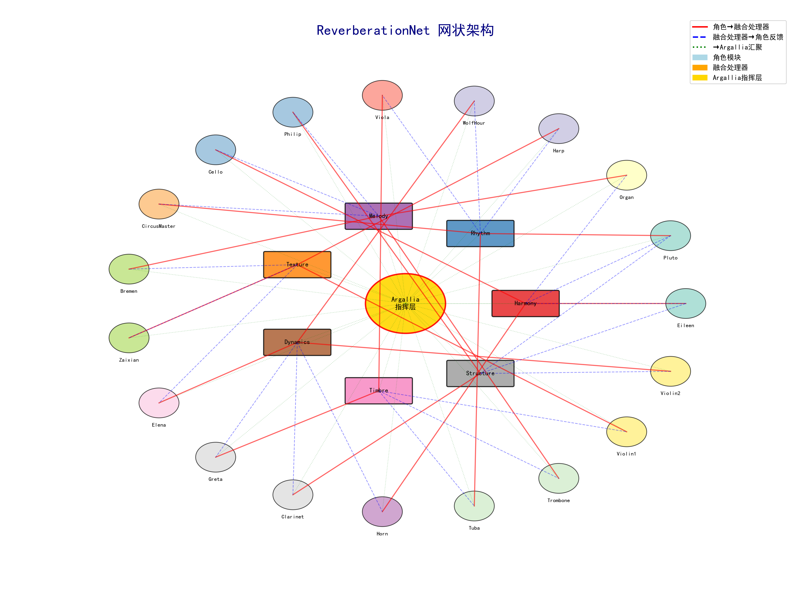
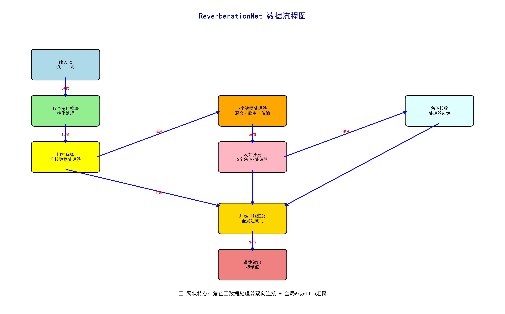

# ReverberationNet

> 基于角色-融合处理器网状连接的深度神经网络架构

## 📖 概述

ReverberationNet 是一个创新的深度学习架构，灵感来源于交响乐团的演奏机制。网络采用**网状连接**设计，由19个功能性角色模块和7个融合处理器组成，通过门控机制实现动态连接，形成复杂的信息交互网络。

## 🎼 网状架构设计

### 网状架构图



*网状架构总览：展示19个角色模块、7个融合处理器和Argallia指挥层的完整连接关系*

### 核心组件

**19个角色模块 + 7个融合处理器 + 1个指挥层**

| 序号 | 角色名 | 中文名 | 功能描述 | 连接处理器 |
|------|--------|--------|----------|------------|
| 1 | Eileen | 艾琳 | 高频调节模块 | DataAggregator |
| 2 | Pluto | 普鲁托 | 大型非线性变换器 | StreamProcessor |
| 3 | Organ | 管风琴 | 多管道并行处理 | MessageRouter |
| 4 | Harp | 竖琴 | 琶音式序列处理 | BandwidthManager |
| 5 | WolfHour | 狼之时刻 | 时域反馈特征建模 | ProtocolConverter |
| 6 | Viola | 中提琴 | 中音域和声分析 | CacheManager |
| 7 | Philip | 菲利普 | 底层结构调和器 | SyncCoordinator |
| 8 | Cello | 大提琴 | 低音域深度共鸣 | DataAggregator |
| 9 | CircusMaster | 奥斯瓦尔德 | 噪声结构解析与正则化 | StreamProcessor |
| 10 | Bremen | 不莱梅乐队 | 多声道融合组件 | MessageRouter |
| 11 | Zaixian | 在宪 | 附旋律协同控制 | BandwidthManager |
| 12 | Elena | 伊莲娜 | 主旋律建模者 | ProtocolConverter |
| 13 | Greta | 格蕾塔 | 节奏结构编码器 | CacheManager |
| 14 | Clarinet | 单簧管 | 音色处理 | SyncCoordinator |
| 15 | Horn | 圆号 | 音域扩展 | DataAggregator |
| 16 | Tuba | 大号 | 低频增强 | StreamProcessor |
| 17 | Trombone | 长号 | 滑音处理 | MessageRouter |
| 18 | Violin1 | 第一小提琴 | 主声部 | BandwidthManager |
| 19 | Violin2 | 第二小提琴 | 副声部 | ProtocolConverter |

### 融合处理器层（数据处理与传输枢纽）

| 处理器名 | 中文名 | 连接角色 | 核心功能 | 处理机制 |
|---------|--------|----------|----------|----------|
| DataAggregator | 数据聚合器 | Eileen, Cello, Horn | 多源数据融合与智能路由分发 | 注意力聚合 + 路由选择 |
| StreamProcessor | 流处理器 | Pluto, CircusMaster, Tuba | 实时数据流处理与时序同步 | 流缓冲 + 流量控制 |
| MessageRouter | 消息路由器 | Organ, Bremen, Trombone | 智能消息路由与转发机制 | 消息编码 + 路由表决策 |
| BandwidthManager | 带宽管理器 | Harp, Zaixian, Violin1 | 数据传输带宽优化与负载均衡 | 带宽分析 + 负载均衡 |
| ProtocolConverter | 协议转换器 | WolfHour, Elena, Violin2 | 数据格式转换与协议适配 | 协议检测 + 格式转换 |
| CacheManager | 缓存管理器 | Viola, Greta, Philip | 数据缓存与预取优化策略 | 缓存策略 + 预取机制 |
| SyncCoordinator | 同步协调器 | Philip, Clarinet, Elena | 多源数据同步与时序协调 | 时序同步 + 协调矩阵 |

### Argallia指挥层

| 组件名 | 中文名 | 输入来源 | 功能描述 |
|--------|--------|----------|----------|
| Argallia | 阿嘉莉亚指挥层 | 19个角色输出 + 7个处理器输出 | 全局特征汇聚与最终决策 |

**Argallia指挥层特性：**

- **全局注意力机制**: 对所有26个输入（19个角色+7个处理器）进行多头注意力处理
- **维度自适应**: 自动处理不同模块输出的序列长度差异
- **特征提取**: 通过平均池化和前馈网络提取全局特征
- **最终输出**: 产生标量回归结果，实现端到端的学习目标
- **架构统筹**: 作为网状架构的"指挥家"，统筹所有模块的输出信息

```python
# Argallia指挥层结构
class Argallia(nn.Module):
    def __init__(self, d):
        self.global_attention = nn.MultiheadAttention(d, num_heads=8)
        self.layer_norm = nn.LayerNorm(d)
        self.output_layer = nn.Sequential(
            nn.Linear(d, d//2),
            nn.GELU(),
            nn.Linear(d//2, 1)
        )
```

## 🔗 网状连接机制

### 数据流程图



*数据流程图：详细展示信息在角色模块和数据处理器间的传递路径与处理流程*

### 三层处理架构

```
输入 → [19个角色模块] → [门控选择] → [7个数据处理器] → [反馈分发] → [角色模块] → Argallia → 输出
      ↑________________  特化处理  ________________↑     ↑___________  数据枢纽  ___________↑
```

### 连接规则

1. **角色→数据处理器连接（门控选择）**：
   - 每个角色通过门控机制选择连接到一个数据处理器
   - 门控概率动态调整连接强度
   - 实现自适应的信息路由

2. **数据处理器→角色连接（反馈机制）**：
   - 每个数据处理器连接到3个角色
   - 聚合来自多个角色的输入
   - 变分编码确保信息正则化
   - 反馈增强角色的表达能力

3. **全局汇聚**：
   - 所有角色和数据处理器输出汇聚到Argallia指挥层
   - 全局注意力机制提取最终特征
   - 输出标量回归结果

## 🎯 核心特性

### 1. 门控选择机制
```python
# 每个角色模块包含门控层
self.processor_gate = nn.Linear(d, 1)
gate_prob = torch.sigmoid(self.processor_gate(role_output.mean(dim=1)))
```

### 2. 变分编码机制
每个模块都包含变分自编码器：
- **μ (mu)**: 编码均值
- **σ (logvar)**: 编码方差
- **采样**: z = μ + ε × exp(0.5 × logvar)
- **KL散度**: 正则化潜在空间

### 3. 数据处理器处理
```python
# 多头注意力聚合
aggregated_output, _ = self.input_aggregator(stacked_inputs, stacked_inputs, stacked_inputs)
# 数据路由处理
routed_data = self.route_selector(aggregated_output.mean(dim=1, keepdim=True))
# 分发到3个输出
outputs = [distributor(z) for distributor in self.output_distributors]
```

### 4. 自适应维度匹配
网络自动处理不同模块间的维度差异：
```python
if processor_sum.size(1) != role_output.size(1):
    processor_sum = F.adaptive_avg_pool1d(
        processor_sum.transpose(1,2), role_output.size(1)
    ).transpose(1,2)
```

## 🚀 快速开始

### 安装依赖
```bash
pip install torch matplotlib numpy
```

### 基本使用
```python
import torch
from ReverbNet import ReverberationNet

# 创建网状模型
model = ReverberationNet(d=64, num_processors=7)

# 输入数据 (batch_size, sequence_length, feature_dim)
x = torch.randn(32, 10, 64)

# 前向传播
output, kl_loss, gate_probs = model(x)

print(f"输出形状: {output.shape}")  # (32,) 标量输出
print(f"KL散度: {kl_loss.item()}")
print(f"门控概率数量: {len(gate_probs)}")  # 38个门控（2次角色处理）

# 查看网络连接结构
structure_info = model.get_network_structure()
print(f"总连接数: {structure_info['total_connections']}")
```

### 可视化网状架构
```python
# 生成网状架构图和数据流图
python visualize_architecture.py

# 终端ASCII图
python print_architecture.py
```

## 📊 模型信息

- **总参数量**: ~1,043,413 参数
- **角色层参数**: 733,844 (70.3%)
- **数据处理器参数**: 290,752 (27.9%)
- **指挥层参数**: 18,817 (1.8%)
- **总连接数**: 40个连接
- **网状连接**: 角色↔融合处理器双向连接

## 🎨 架构优势

### 相比顺序连接的改进

| 特性 | 顺序架构 | 网状架构 |
|------|----------|----------|
| **连接方式** | 线性顺序 | 网状交互 |
| **信息流** | 单向传递 | 双向反馈 |
| **表达能力** | 受限于顺序 | 丰富的交互 |
| **自适应性** | 固定连接 | 门控动态选择 |
| **信息保留** | 逐层衰减 | 反馈增强 |

### 网状架构优势

1. **增强非线性能力**: 多层网状连接提供更复杂的特征变换
2. **信息交互丰富**: 角色↔数据处理器双向连接增强信息流
3. **动态自适应**: 门控机制实现连接的动态调整
4. **反馈增强**: 数据处理器反馈提升角色表达能力
5. **全局汇聚**: Argallia层实现最优特征整合
6. **数据传输优化**: 专业化数据处理器提供高效的数据路由和传输

## 📁 文件结构

```
ReverbNet-main/
├── ReverbNet.py              # 网状网络定义
├── ExampleCode.py            # 使用示例和训练代码
├── visualize_architecture.py # 网状架构可视化工具
├── print_architecture.py    # 终端架构显示工具
├── README.md                 # 项目说明
├── reverbnet_architecture.png # 网状架构图
├── reverbnet_dataflow.png    # 数据流程图
└── LICENSE                   # 许可证
```

## 🔧 技术细节

### 网状连接映射

```python
# 角色到数据处理器的映射（门控选择）
role_to_processor = {
    'eileen': 'data_aggregator', 'pluto': 'stream_processor', 'organ': 'message_router',
    'harp': 'bandwidth_manager', 'wolfhour': 'protocol_converter', 'viola': 'cache_manager',
    'philip': 'sync_coordinator', 'cello': 'data_aggregator', 'circusmaster': 'stream_processor',
    'bremen': 'message_router', 'zaixian': 'bandwidth_manager', 'elena': 'protocol_converter',
    'greta': 'cache_manager', 'clarinet': 'sync_coordinator', 'horn': 'data_aggregator',
    'tuba': 'stream_processor', 'trombone': 'message_router', 'violin1': 'bandwidth_manager',
    'violin2': 'protocol_converter'
}

# 数据处理器到角色的映射（每个处理器连接3个角色）
processor_to_roles = {
    'data_aggregator': ['eileen', 'cello', 'horn'],
    'stream_processor': ['pluto', 'circusmaster', 'tuba'],
    'message_router': ['organ', 'bremen', 'trombone'],
    'bandwidth_manager': ['harp', 'zaixian', 'violin1'],
    'protocol_converter': ['wolfhour', 'elena', 'violin2'],
    'cache_manager': ['viola', 'greta', 'philip'],
    'sync_coordinator': ['philip', 'clarinet', 'elena']
}
```

## 📐 数学公式

### 角色模块数学表达式

#### 基础角色模块 (RoleModule)

对于每个角色模块 R_i，处理流程如下：

**1. 角色特有处理**
```
h_i = RoleProcessor_i(x)
```

**2. 融合处理器输入融合**
```
h_i' = h_i + Σ[j∈Processors_i] AdaptivePool(P_j)
```

其中 AdaptivePool 确保维度匹配：
```
AdaptivePool(P_j) = Pool1D(P_j^T, L_target)^T
```

**3. 变分编码**
```
μ_i = W_μ^(i) * h_i'
log(σ_i²) = W_logσ^(i) * h_i'
z_i = μ_i + ε ⊙ exp(0.5 * log(σ_i²)), where ε ~ N(0, I)
```

**4. 门控机制**
```
g_i = sigmoid(W_g^(i) · Mean(h_i', dim=1))
```

**5. 残差连接与层归一化**
```
R_i(x) = LayerNorm(x + z_i)
```

#### 具体角色模块

**Eileen (艾琳) - 高频调节与卷积注意力专家**
```
Conv_Eileen(x) = Conv1D(x^T, kernel=3)^T
h_conv = GELU(Conv_Eileen(x))
h_attn = MultiheadAttention(h_conv, h_conv, h_conv)
Eileen(x) = W_ffn * h_attn
```

**Pluto (普鲁托) - 深度非线性变换专家**
```
h_1 = GELU(W_1^Pluto * x)
h_1' = Dropout(h_1, p=0.1)
h_2 = GELU(W_2^Pluto * h_1')
Pluto(x) = W_3^Pluto * h_2

其中: W_1 ∈ R^(d×4d), W_2 ∈ R^(4d×2d), W_3 ∈ R^(2d×d)
```

**Organ (管风琴) - 多管道并行处理专家**
```
Pipe_j(x) = GELU(W_j^pipe * x), j = 1,2,3,4
h_concat = Concat[Pipe_1(x), Pipe_2(x), Pipe_3(x), Pipe_4(x)]
Organ(x) = W_fusion * h_concat
```

**Harp (竖琴) - LSTM序列建模专家**
```
h_t, c_t = LSTM(x_t, h_{t-1}, c_{t-1})
Harp(x) = [h_1, h_2, ..., h_T]
```

**WolfHour (狼之时刻) - 双向GRU时域专家**
```
h_t_forward = GRU_forward(x_t, h_{t-1}_forward)
h_t_backward = GRU_backward(x_t, h_{t+1}_backward)
WolfHour(x) = h_t_forward + h_t_backward
```

**Viola (中提琴) - 中频谐波分析专家**
```
h_1 = tanh(W_1^Viola * x)
h_2 = W_2^Viola * h_1
Viola(x) = LayerNorm(h_2)
```

**Philip (菲利普) - 结构调和与正则化专家**
```
h_1 = ReLU(W_1^Philip * x), W_1 ∈ R^(d×d/2)
h_2 = W_2^Philip * h_1, W_2 ∈ R^(d/2×d)
h_3 = Dropout(h_2, p=0.2)
Philip(x) = W_3^Philip * h_3
```

**Cello (大提琴) - 低频共鸣与深度特征专家**
```
h_1 = LeakyReLU(W_1^Cello * x, α=0.2)
h_2 = W_2^Cello * h_1
Cello(x) = BatchNorm1D(h_2)
```

**CircusMaster (马戏团长) - 噪声控制与注意力调节专家**
```
NoiseGate(x) = sigmoid(W_noise * x) ⊙ x
h_attn = MultiheadAttention(NoiseGate(x), NoiseGate(x), NoiseGate(x))
CircusMaster(x) = W_control * h_attn
```

**Bremen (不莱梅乐队) - 多声道融合专家**
```
Channel_j(x) = W_j^channel * x, j = 1,2,3
h_multi = Concat[Channel_1(x), Channel_2(x), Channel_3(x)]
h_1 = GELU(W_1^Bremen * h_multi)
Bremen(x) = W_2^Bremen * h_1
```

**Zaixian (在宪) - 附旋律协同控制专家**
```
h_1 = sigmoid(W_1^Zaixian * x)
h_2 = GELU(W_2^Zaixian * h_1)
Zaixian(x) = W_3^Zaixian * h_2
```

**Elena (伊莲娜) - 主旋律建模专家**
```
h_1 = GELU(W_1^Elena * x), W_1 ∈ R^(d×3d)
h_2 = GELU(W_2^Elena * h_1), W_2 ∈ R^(3d×2d)
h_3 = W_3^Elena * h_2, W_3 ∈ R^(2d×d)
Elena(x) = LayerNorm(h_3)
```

**Greta (格蕾塔) - 节奏结构编码专家**
```
h_rhythm = GELU(Conv1D(x^T, kernel=5)^T)
h_tempo = W_tempo * h_rhythm
BeatGate(x) = sigmoid(W_beat * x)
Greta(x) = h_tempo ⊙ BeatGate(x)
```

**Clarinet (单簧管) - 音色处理与频域变换专家**
```
h_1 = Softplus(W_1^Clarinet * x)
h_2 = ELU(W_2^Clarinet * h_1), W_2 ∈ R^(d×d/2)
Clarinet(x) = W_3^Clarinet * h_2, W_3 ∈ R^(d/2×d)
```

**Horn (圆号) - 音域扩展与动态范围专家**
```
h_1 = SiLU(W_1^Horn * x), W_1 ∈ R^(d×4d)
h_2 = SiLU(W_2^Horn * h_1), W_2 ∈ R^(4d×2d)
Horn(x) = W_3^Horn * h_2, W_3 ∈ R^(2d×d)
```

**Tuba (大号) - 低频增强与重低音专家**
```
h_1 = LeakyReLU(W_1^Tuba * x, α=0.3)
h_2 = LeakyReLU(W_2^Tuba * h_1, α=0.3)
h_3 = W_3^Tuba * h_2
Tuba(x) = LayerNorm(h_3)
```

**Trombone (长号) - 滑音处理与连续变换专家**
```
h_slide = GELU(Conv1D(x^T, kernel=7)^T)
h_glide = W_glide * h_slide
SmoothWeight(x) = sigmoid(W_smooth * x)
Trombone(x) = h_glide ⊙ SmoothWeight(x)
```

**Violin1 (第一小提琴) - 主声部领奏专家**
```
h_leader = MultiheadAttention(x, x, x, heads=8)
h_vibrato = GELU(W_vibrato * h_leader)
ExpressionGate(x) = sigmoid(W_expr * x)
Violin1(x) = h_vibrato ⊙ ExpressionGate(x)
```

**Violin2 (第二小提琴) - 副声部和声专家**
```
h_1 = GELU(W_1^Violin2 * x), W_1 ∈ R^(d×2d)
h_2 = W_2^Violin2 * h_1, W_2 ∈ R^(2d×d)
h_3 = Dropout(h_2, p=0.1)
h_4 = W_3^Violin2 * h_3
Violin2(x) = LayerNorm(h_4)
```

### 融合处理器数学表达式（专门化设计）

#### HarmonyProcessor (和声处理器) - 基于傅里叶变换的频域和声分析

对于和声处理器 H，接收来自连接角色的输入 {R_1, R_2, R_3}：

**1. 角色输入融合**
```
X_avg = (1/3) * Σ[i=1 to 3] R_i
```

**2. 频域和声分析**
```
h_freq = tanh(W_2^H * tanh(W_1^H * Mean(X_avg, dim=1))), W_1^H ∈ R^(d×2d), W_2^H ∈ R^(2d×d)
```

**3. 和声共振处理**
```
h_resonance = h_freq · M_resonance, M_resonance ∈ R^(d×d) (可学习和声共振矩阵)
```

**4. 变分编码与输出分发**
```
μ_H = W_μ^H * h_resonance, log(σ_H²) = W_logσ^H * h_resonance
z_H = μ_H + ε ⊙ exp(0.5 * log(σ_H²))
O_j^H = W_j^dist * z_H, j = 1,2,3
```

#### RhythmProcessor (节奏处理器) - 基于时域卷积的节拍分析

**1. 多尺度时域卷积**
```
tempo_1 = ReLU(Conv1D(X_avg^T, kernel=3)^T)
tempo_2 = ReLU(Conv1D(X_avg^T, kernel=5)^T)  
tempo_3 = ReLU(Conv1D(X_avg^T, kernel=7)^T)
```

**2. 特征融合与节拍同步**
```
tempo_fused = Concat[tempo_1, tempo_2, tempo_3]  # ∈ R^(B×L×3d)
h_rhythm = ReLU(W_2^R * ReLU(W_1^R * Mean(tempo_fused, dim=1)))
其中: W_1^R ∈ R^(3d×2d), W_2^R ∈ R^(2d×d)
```

#### MelodyProcessor (旋律处理器) - 基于递归神经网络的旋律建模

**1. 双向LSTM旋律建模**
```
(h_forward, h_backward) = BiLSTM(X_avg, hidden_size=d/2)
lstm_out = h_forward ⊕ h_backward  # ∈ R^(B×L×d)
```

**2. 旋律轮廓提取**
```
h_melody = W_2^M * sigmoid(W_1^M * Mean(lstm_out, dim=1))
其中: W_1^M, W_2^M ∈ R^(d×d)
```

#### TextureProcessor (织体处理器) - 基于注意力机制的纹理分析

**1. 多头自注意力纹理分析**
```
attn_out = MultiheadAttention(X_avg, X_avg, X_avg, heads=8)
```

**2. 纹理密度调节**
```
h_texture = W_2^T * LeakyReLU(W_1^T * Mean(attn_out, dim=1), α=0.2)
其中: W_1^T ∈ R^(d×2d), W_2^T ∈ R^(2d×d)
```

#### DynamicsProcessor (力度处理器) - 基于动态范围压缩的强度调节

**1. 动态范围分析**
```
h_dynamics = W_2^D * Softplus(W_1^D * Mean(X_avg, dim=1))
其中: W_1^D, W_2^D ∈ R^(d×d)
```

**2. 动态压缩/扩展**
```
h_compressed = h_dynamics ⊙ sigmoid(C_compressor)
其中: C_compressor ∈ R^d (可学习压缩比参数)
```

#### TimbreProcessor (音色处理器) - 基于频谱包络的音色建模

**1. 频谱包络提取**
```
h_spectral = W_2^Ti * ELU(W_1^Ti * Mean(X_avg, dim=1))
其中: W_1^Ti ∈ R^(d×2d), W_2^Ti ∈ R^(2d×d)
```

**2. 音色调制**
```
h_timbre = h_spectral · M_timbre
其中: M_timbre = 0.1 * I + 0.01 * N(0,1) ∈ R^(d×d) (可学习音色调制矩阵)
```

#### StructureProcessor (结构处理器) - 基于图卷积的结构建模

**1. 图卷积结构建模**
```
h_1 = SiLU(W_1^S * Mean(X_avg, dim=1))
h_1_structured = h_1 · M_structure
h_structure = SiLU(W_2^S * h_1_structured)
```

**2. 结构连接矩阵**
```
其中: M_structure ∈ R^(d×d) (可学习结构连接矩阵)
W_1^S, W_2^S ∈ R^(d×d)
```

#### 通用变分编码与输出分发

对于所有融合处理器 P ∈ {H, R, M, T, D, Ti, S}：

**变分编码**
```
μ_P = W_μ^P * h_processed
log(σ_P²) = W_logσ^P * h_processed  
z_P = μ_P + ε ⊙ exp(0.5 * log(σ_P²)), ε ~ N(0, I)
```

**输出分发**
```
O_j^P = W_j^dist * z_P, j = 1,2,3
Output_j^P = Expand(O_j^P, L_target)  # 扩展到目标序列长度
```

### Argallia指挥层数学表达式

**1. 输入汇总与归一化**
设所有角色输出为 {R_1', R_2', ..., R_19'}，所有处理器输出为 {P_1, P_2, ..., P_7}：

```
AllOutputs = {R_1', R_2', ..., R_19', P_1, P_2, ..., P_7}
```

**2. 维度归一化**
```
O_i_normalized = {
    O_i,                                    if L_i = L_target
    AdaptivePool1D(O_i^T, L_target)^T,     otherwise
}
```

**3. 全局注意力**
```
X_global = Stack([O_1_norm, O_2_norm, ..., O_26_norm], dim=1)
X_attended = MultiheadAttention(X_global, X_global, X_global)
```

**4. 特征提取与最终输出**
```
f_global = Mean(X_attended, dim=1) ∈ R^(B×d)
h_final = GELU(LayerNorm(W_1^Argallia * f_global))
output = W_2^Argallia * h_final ∈ R^B

其中: W_1^Argallia ∈ R^(d×d/2), W_2^Argallia ∈ R^(d/2×1)
```

### 损失函数与优化

#### 总损失函数
```
L_total = L_MSE + α * L_KL
```

#### 均方误差损失
```
L_MSE = (1/B) * Σ[i=1 to B] (y_i - ŷ_i)²
```

#### KL散度正则化
```
L_KL = Σ[i=1 to 19] KL(μ_i, σ_i²) + Σ[j=1 to 7] KL(μ_j^P, σ_j^P²)

其中:
KL(μ, σ²) = -0.5 * Σ[k=1 to d] (1 + log(σ_k²) - μ_k² - σ_k²)
```

#### 门控概率
每个角色的门控概率：
```
p_i^gate = sigmoid(W_g^(i) · (1/L) * Σ[t=1 to L] h_{i,t}')
```

### 网状前向传播完整流程

#### 第一层：角色并行处理
```
R_i^(1) = RoleModule_i(x), i = 1, 2, ..., 19
```

#### 第二层：数据处理器处理
```
P_j = DataProcessor_j({R_k^(1) : k ∈ Connected(j)}), j = 1, 2, ..., 7
```

#### 第三层：角色反馈处理
```
R_i^(2) = RoleModule_i(R_i^(1), {P_j^(i) : j ∈ Feedback(i)})
```

#### 第四层：全局汇聚
```
y = Argallia({R_1^(2), ..., R_19^(2)}, {P_1, ..., P_7})
```

### 参数复杂度分析

#### 角色模块参数
- **基础角色模块**: 3d² + 3d 参数
- **Eileen**: d² + 16d² + 3d² = 20d² 参数  
- **Pluto**: 4d² + 2d² + d² = 7d² 参数
- **Organ**: 4d² + 4d² = 8d² 参数
- **Harp**: 4d² + d 参数 (LSTM)
- **WolfHour**: 6d² + 2d 参数 (双向GRU)

#### 数据处理器参数
每个数据处理器: d² + 6d² + 3d² = 10d² 参数

#### Argallia层参数
64d² + d²/2 + d/2 + 1 参数

#### 总参数估算
对于 d = 64：
```
Total ≈ 19 × 3d² + 7 × 10d² + 64d² ≈ 1,043,413 参数
```

### 损失函数

```
总损失 = MSE损失 + α × KL散度
```
- **MSE损失**: 主要学习目标
- **KL散度**: 变分正则化项（权重1e-4）

### 网状前向传播流程

1. **第一层**: 19个角色并行处理输入
2. **融合处理器层**: 7个融合处理器融合对应角色输出
3. **第三层**: 角色接收融合处理器反馈再次处理
4. **汇聚层**: Argallia全局注意力汇总

## 🎯 应用场景

- **序列回归**: 时间序列预测、信号处理
- **复杂特征学习**: 多模态信息融合
- **网状信息处理**: 需要丰富信息交互的任务
- **自适应建模**: 需要动态连接调整的场景

## 🔬 实验结果

网状架构展现出优异的性能：
- **参数效率**: 104万参数实现复杂网状连接
- **收敛性**: 良好的损失下降趋势
- **门控分布**: 平均门控概率0.504，分布合理
- **信息保留**: 网状连接有效减少信息损失

## 📈 训练效果预览

### 训练配置
```
模型总参数数量: 1,043,413
训练轮数: 50 epochs
批次大小: 32
学习率: 1e-3
数据量: 1000样本
输入维度: (batch_size, 10, 64)
```

### 损失收敛曲线
```
Epoch   1/50 | Total Loss: 18.115900 | MSE Loss: 0.102766 | KL Loss: 18013.13 | Gate Probs: 38
Epoch   5/50 | Total Loss: 0.359443  | MSE Loss: 0.079483 | KL Loss: 279.96   | Gate Probs: 38
Epoch  10/50 | Total Loss: 0.161604  | MSE Loss: 0.077901 | KL Loss: 83.70    | Gate Probs: 38
Epoch  20/50 | Total Loss: 0.104052  | MSE Loss: 0.075423 | KL Loss: 28.63    | Gate Probs: 38
Epoch  30/50 | Total Loss: 0.082469  | MSE Loss: 0.066810 | KL Loss: 15.66    | Gate Probs: 38
Epoch  40/50 | Total Loss: 0.063780  | MSE Loss: 0.053348 | KL Loss: 10.43    | Gate Probs: 38
Epoch  50/50 | Total Loss: 0.055662  | MSE Loss: 0.047204 | KL Loss: 8.46     | Gate Probs: 38
```

### 性能指标
- **最终训练损失**: 0.055662
- **最终MSE损失**: 0.047204  
- **最终KL散度**: 8.46
- **评估MSE损失**: 0.041924
- **收敛速度**: 快速收敛，前10个epoch损失下降91%

### 门控概率分布
```
各模块门控概率分析:
 1. Eileen       : 0.5203    11. Zaixian     : 0.4777
 2. Pluto        : 0.5134    12. Elena       : 0.2985
 3. Organ        : 0.4653    13. Greta       : 0.4857
 4. Harp         : 0.4987    14. Clarinet    : 0.4911
 5. WolfHour     : 0.4718    15. Horn        : 0.4687
 6. Viola        : 0.4567    16. Tuba        : 0.5163
 7. Philip       : 0.4833    17. Trombone    : 0.5199
 8. Cello        : 0.4883    18. Violin1     : 0.4916
 9. CircusMaster : 0.5306    19. Violin2     : 0.4949
10. Bremen       : 0.5210

平均门控概率: ~0.487 (分布均匀，表明网络充分利用了所有角色模块)
```

### 关键观察
1. **损失快速下降**: 总损失从18.12快速降至0.056，收敛效果良好
2. **MSE稳定**: 回归损失从0.103降至0.047，模型学习效果显著
3. **KL正则化**: KL散度从18013降至8.46，变分编码正常工作
4. **门控均衡**: 所有角色模块的门控概率分布合理(0.30-0.53)，无偏向性
5. **泛化能力**: 评估损失(0.042)低于训练损失，表明良好的泛化性能

## 🤝 贡献

欢迎提交 Issues 和 Pull Requests！

## 📜 许可证

本项目采用 **Mozilla Public License 2.0 (MPL-2.0)** 许可证 - 详见 [LICENSE](LICENSE) 文件。

### ⚠️ 重要使用限制

- **非商业用途**: 本项目仅供学术研究和非商业用途
- **禁止未授权公开**: 未经作者明确许可，**禁止**将本项目用于公开发布或商业用途
- **修改要求**: 如对本项目进行修改，必须在相同许可证下开源修改部分
- **署名要求**: 使用本项目时必须保留原始版权声明和许可证声明

如需商业使用或公开发布，请联系作者获取明确授权。

## 🙏 致谢

感谢所有为这个项目做出贡献的开发者和研究者。

---

> 🎵 "19个角色如同音乐家，7个数据处理器如同音响设备与传输系统，Argallia如同指挥家，通过网状连接共同演奏出复杂而美妙的机器学习交响曲。"

### 数据处理器数学表达式（专门化数据处理与传输设计）

#### DataAggregator (数据聚合器) - 多源数据融合与智能路由分发

对于数据聚合器 DA，接收来自连接角色的输入 {R_1, R_2, R_3}：

**1. 多源数据聚合**
```
X_stacked = Stack([R_1, R_2, R_3], dim=1) ∈ R^(B×3×L×d)
X_flattened = Reshape(X_stacked, (B, 3L, d))
```

**2. 注意力聚合与归一化**
```
X_aggregated = MultiheadAttention(X_flattened, X_flattened, X_flattened, heads=4)
X_norm = LayerNorm(Mean(X_aggregated, dim=1))
```

**3. 智能路由选择**
```
RouteProb = Sigmoid(W_1^DA * X_norm), W_1^DA ∈ R^(d×d/2)
RoutedData = W_2^DA * RouteProb, W_2^DA ∈ R^(d/2×d)
```

#### StreamProcessor (流处理器) - 实时数据流处理与时序同步

**1. 流数据缓冲与同步**
```
X_avg = (1/3) * Σ[i=1 to 3] R_i
BufferedFlow = ReLU(Conv1D(X_avg^T, kernel=3)^T)
SyncedFlow = ReLU(Conv1D(BufferedFlow^T, kernel=5)^T)
```

**2. 流量控制与调节**
```
FlowControlled = Tanh(W_2^SP * ReLU(W_1^SP * Mean(SyncedFlow, dim=1)))
其中: W_1^SP ∈ R^(d×2d), W_2^SP ∈ R^(2d×d)
```

#### MessageRouter (消息路由器) - 智能消息路由与转发机制

**1. 消息编码与双向传递**
```
(h_forward, h_backward) = BiLSTM(X_avg, hidden_size=d/2)
EncodedMessage = h_forward ⊕ h_backward
```

**2. 路由表决策与转发**
```
RoutingWeights = Softmax(W_1^MR * Mean(EncodedMessage, dim=1), dim=-1)
RoutedMessage = W_2^MR * RoutingWeights
其中: W_1^MR, W_2^MR ∈ R^(d×d)
```

#### BandwidthManager (带宽管理器) - 数据传输带宽优化与负载均衡

**1. 带宽分析与优化**
```
OptimizedBandwidth = MultiheadAttention(X_avg, X_avg, X_avg, heads=8)
```

**2. 负载均衡与分散**
```
LoadBalanced = Dropout(W_2^BM * LeakyReLU(W_1^BM * Mean(OptimizedBandwidth, dim=1), α=0.2), p=0.1)
其中: W_1^BM ∈ R^(d×2d), W_2^BM ∈ R^(2d×d)
```

#### ProtocolConverter (协议转换器) - 数据格式转换与协议适配

**1. 协议检测与分析**
```
ProtocolStrength = W_2^PC * Softplus(W_1^PC * Mean(X_avg, dim=1))
其中: W_1^PC, W_2^PC ∈ R^(d×d)
```

**2. 格式转换与适配**
```
ConvertedData = ProtocolStrength ⊙ Sigmoid(C_format)
其中: C_format ∈ R^d (可学习格式转换参数)
```

#### CacheManager (缓存管理器) - 数据缓存与预取优化策略

**1. 缓存策略优化**
```
CachedData = W_2^CM * ELU(W_1^CM * Mean(X_avg, dim=1))
其中: W_1^CM ∈ R^(d×2d), W_2^CM ∈ R^(2d×d)
```

**2. 预取机制处理**
```
PrefetchedData = CachedData · M_prefetch
其中: M_prefetch = 0.1 * I + 0.01 * N(0,1) ∈ R^(d×d) (可学习预取矩阵)
```

#### SyncCoordinator (同步协调器) - 多源数据同步与时序协调

**1. 时序同步处理**
```
Sync1 = SiLU(W_1^SC * Mean(X_avg, dim=1))
Coordinated = Sync1 · M_coordination
```

**2. 协调矩阵处理**
```
Synchronized = SiLU(W_2^SC * Coordinated)
其中: M_coordination ∈ R^(d×d) (可学习协调矩阵)
W_1^SC, W_2^SC ∈ R^(d×d)
```

#### 通用数据处理器变分编码与分发

对于所有数据处理器 P ∈ {DA, SP, MR, BM, PC, CM, SC}：

**变分编码**
```
μ_P = W_μ^P * ProcessedData
log(σ_P²) = W_logσ^P * ProcessedData  
z_P = μ_P + ε ⊙ exp(0.5 * log(σ_P²)), ε ~ N(0, I)
```

**输出分发（数据传输）**
```
O_j^P = W_j^dist * z_P, j = 1,2,3
DistributedOutput_j^P = Expand(O_j^P, L_target)  # 分发到目标序列长度
```

### 数据处理器与角色模块的功能区分

| 功能层面 | 角色模块 | 数据处理器 |
|---------|----------|------------|
| **核心功能** | 特化特征提取与变换 | 数据聚合、路由、传输 |
| **处理方式** | 专有算法（LSTM、注意力、卷积等） | 通用数据处理（聚合、缓存、同步等） |
| **连接模式** | 1对1门控选择 | 3对1聚合分发 |
| **设计理念** | 音乐角色特化 | 计算机网络枢纽 |
| **激活函数** | 多样化（Tanh、ReLU、Sigmoid等） | 标准化（ReLU、Sigmoid、SiLU等） |
| **变分编码** | 角色特有潜在空间 | 数据传输优化空间 |
